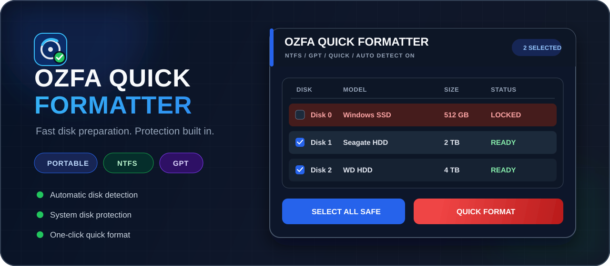

<p align="center">
  
</p>

<h1 align="center">OZFA Quick Formatter</h1>

<p align="center">
  <strong>Fast disk preparation. Protection built in.</strong><br>
  A focused, portable Windows utility for preparing multiple non-system disks in seconds.
</p>

> [!NOTE]
> This is the official public downloads and documentation repository. It contains release binaries, checksums, and public-facing project materials—not the private development source tree.

<p align="center">
  <a href="https://github.com/KlowzyZ/OZFA-Quick-Formatter/releases/latest"></a>
  
  
  <a href="LICENSE"></a>
</p>

<p align="center">
  <a href="https://github.com/KlowzyZ/OZFA-Quick-Formatter/releases/latest"></a>
</p>

<p align="center">
  
</p>

## Built for a focused workflow

| 🔄 **Automatic detection** | 🛡️ **Protected by design** | ⚡ **Batch formatting** |
|:---:|:---:|:---:|
| Detects disk arrival and removal without a manual refresh. | Locks Windows, boot, system, and application disks. | Select every eligible disk and prepare them in one operation. |
| **GPT + NTFS** | **Identity revalidation** | **Post-format verification** |
| Creates one clean GPT partition and performs an NTFS quick format. | Rechecks each selected disk immediately before any destructive action. | Confirms the layout, file system, label, drive letter, and partition count. |

## Quick start

1. Download the latest portable EXE from [GitHub Releases](https://github.com/KlowzyZ/OZFA-Quick-Formatter/releases/latest).
2. Run it and approve the Windows Administrator prompt.
3. Review the detected disks, choose the safe targets, and select **Quick Format**.

No installer, background service, or PowerShell window is required.

> [!CAUTION]
> Formatting permanently destroys all data on every selected disk. Always verify the disk model and capacity before continuing. Test new releases only with non-important disks.

## Safety pipeline

```text
Detect disks → Exclude protected disks → Select safe targets
             → Revalidate identity → Format → Verify result → Write log
```

- Stops immediately on the first error.
- Uses an available drive letter automatically.
- Labels the resulting volume `Yeni Birim`.
- Writes detailed operation logs under `%LOCALAPPDATA%\OzfaQuickFormatter\Logs`.
- Checks GitHub Releases for updates and validates downloads with SHA-256.

## Technical profile

| | |
|---|---|
| **Platform** | Windows 10 / 11 x64 |
| **Runtime** | .NET Framework 4.8 |
| **Interface** | Native C# WinForms |
| **Partition style** | GPT |
| **File system** | NTFS — Quick Format |
| **Installation** | None — single portable EXE |

## License

Current official downloads are provided under the [OZFA Quick Formatter Proprietary License](LICENSE); the source code is not publicly licensed. Copies previously received under GPL-3.0 retain those rights, and the historical license text is preserved under [LICENSES](LICENSES/README.md). See the [third-party notices](THIRD-PARTY-NOTICES.md) and [changelog](CHANGELOG.md) for details.

<p align="center">
  <sub>Copyright © 2026 Klowzy · Developed for OZFA</sub>
</p>
